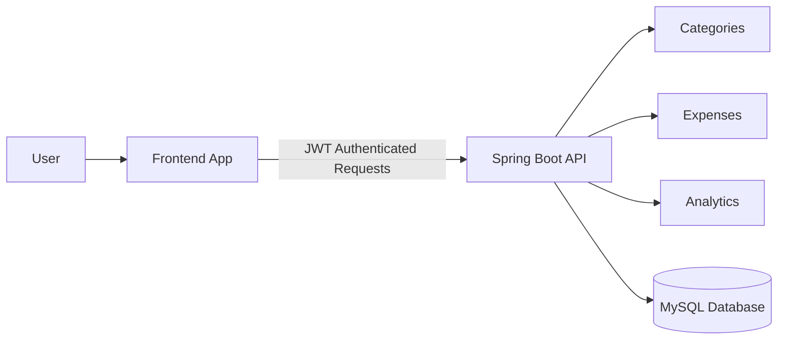
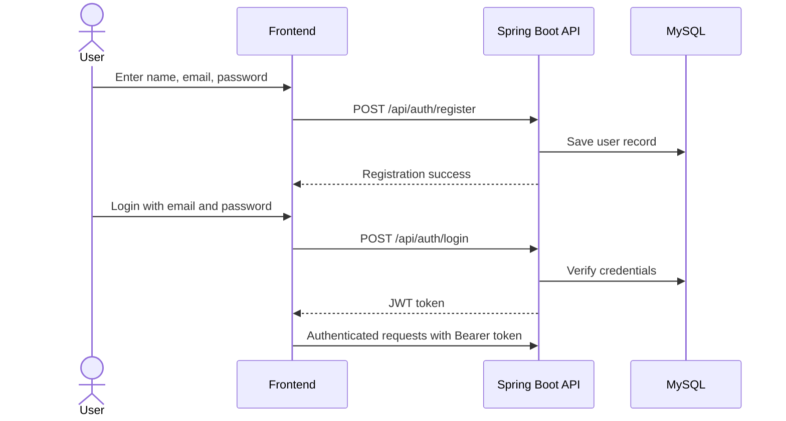
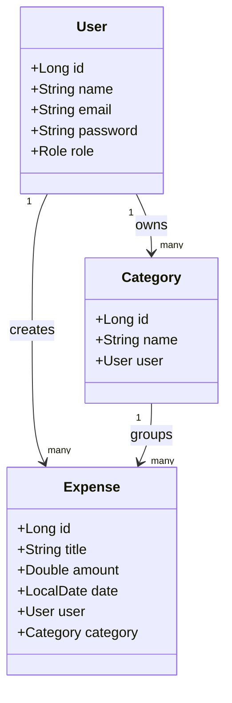
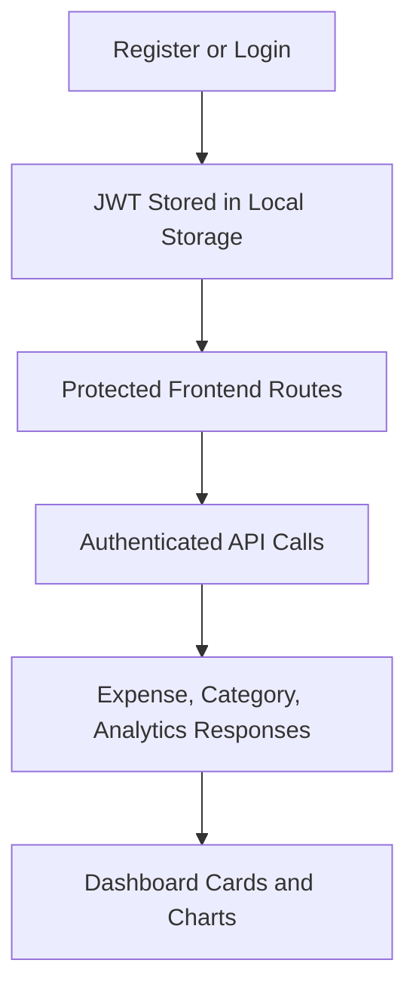

# Expense Tracker with Analytics Dashboard


Expense Tracker with Analytics Dashboard is a full-stack personal finance application built with Spring Boot on the backend and React with TypeScript on the frontend. The application supports secure authentication, category and expense management, and analytics-driven visualizations for spending trends.

## Project Overview

This repository is organized as a monorepo:

- Backend service: `expense-tracker-backend/expense-tracker`
- Frontend application: `frontend`
- Local orchestration: `docker-compose.yml`

The backend exposes a REST API secured with JWT. The frontend consumes that API to provide a dashboard experience with charts, summaries, and transaction management.

## Visual Overview







## Features

### Authentication

- User registration
- User login
- Password change
- JWT-based session handling

### Expense Management

- Create expenses
- View expenses
- Update expenses
- Delete expenses
- Filter expense lists by category and date

### Category Management

- Create categories
- View categories
- Delete categories

### Analytics

- Monthly expense trend visualization
- Category-wise spending breakdown
- Summary cards for total spend and average spend

### User Interface

- Responsive dashboard layout
- Reusable logo and favicon branding
- Chart-driven analytics views
- Modern dark visual design with centered content columns

## Technology Stack

### Backend

- Java 21
- Spring Boot 3.3.5
- Spring Security
- Spring Data JPA
- MySQL
- Maven

### Frontend

- React 18
- TypeScript
- Vite
- Recharts
- Axios

### DevOps

- Docker
- Docker Compose

## Key Screens

- Authentication pages for registration and login
- Dashboard with KPI cards and analytics charts
- Expense management screen with filters and CRUD actions
- Category management screen for organizing spend categories
- Settings screen for password updates

## Repository Structure

```text
smart-expense-tracker-with-analytics-dashboard/
├─ Readme.md
├─ .gitignore
├─ docker-compose.yml
├─ expense-tracker-backend/
│  └─ expense-tracker/
│     ├─ Dockerfile
│     ├─ pom.xml
│     └─ src/
│        ├─ main/
│        │  ├─ java/com/expensetracker/expense_tracker/
│        │  │  ├─ config/
│        │  │  ├─ controller/
│        │  │  ├─ dto/
│        │  │  ├─ entity/
│        │  │  ├─ exception/
│        │  │  ├─ repository/
│        │  │  ├─ security/
│        │  │  └─ service/
│        │  └─ resources/
│        │     └─ application.properties
│        └─ test/
└─ frontend/
   ├─ Dockerfile
   ├─ nginx.conf
   ├─ package.json
   ├─ package-lock.json
   └─ src/
      ├─ components/
      ├─ context/
      ├─ lib/
      ├─ pages/
      ├─ services/
      ├─ types.ts
      └─ styles.css
```

## Backend API

### Authentication

- `POST /api/auth/register`
- `POST /api/auth/login`
- `POST /api/auth/change-password`

### Categories

- `POST /api/categories`
- `GET /api/categories`
- `DELETE /api/categories/{id}`

### Expenses

- `POST /api/expenses`
- `GET /api/expenses`
- `PUT /api/expenses/{id}`
- `DELETE /api/expenses/{id}`

### Analytics

- `GET /api/analytics/monthly`
- `GET /api/analytics/category`

## Data Model

### User

- `id`
- `name`
- `email`
- `password`
- `role`

### Category

- `id`
- `name`
- `user_id`

### Expense

- `id`
- `title`
- `amount`
- `date`
- `category_id`
- `user_id`

## Local Development

### Prerequisites

- Java 21
- Node.js 20 or later
- MySQL 8+
- Maven, or the Maven Wrapper provided in the backend module

### Backend Configuration

The backend reads the following environment variables:

- `DB_USERNAME`
- `DB_PASSWORD`
- `JWT_SECRET`

The default database URL is:

```properties
spring.datasource.url=jdbc:mysql://localhost:3306/expense_tracker?createDatabaseIfNotExist=true
```

### Run the Backend Locally

```bash
cd expense-tracker-backend/expense-tracker
```

On Windows:

```bash
.\mvnw.cmd spring-boot:run
```

On Unix-like systems:

```bash
./mvnw spring-boot:run
```

### Run the Frontend Locally

```bash
cd frontend
npm install
npm run dev
```

The frontend expects the API to be available at `http://localhost:8080` unless `VITE_API_BASE_URL` is set.

## Docker Setup

This repository includes Docker configuration for the backend, frontend, and MySQL database.

### Start the Full Stack

```bash
docker compose up --build
```

### Service Ports

- Frontend: `http://localhost:5173`
- Backend API: `http://localhost:8080`
- MySQL: `localhost:3306`

### Notes

- The frontend image serves the built Vite application through Nginx.
- The backend image is built from the Maven project and runs on a slim Java 21 runtime.
- Docker Compose initializes a dedicated MySQL container and persists data in a named volume.

## Frontend Behavior

- JWT tokens are stored in browser local storage.
- The user display name is read from the JWT payload and shown in the dashboard shell.
- The dashboard uses chart components for monthly and category analytics.
- The layout is centered and constrained to avoid an overly stretched horizontal presentation on large screens.

## Data Flow



## Environment Variables

### Backend

- `DB_USERNAME`
- `DB_PASSWORD`
- `JWT_SECRET`

### Frontend

- `VITE_API_BASE_URL`

## Development Notes

- Keep DTO contracts in sync between the backend and frontend.
- Use request parameters when calling the expense and category mutation endpoints, because the backend currently expects query parameters for those operations.
- The backend is configured to allow requests from the local frontend development ports.

## License

This project is licensed under the MIT License.
